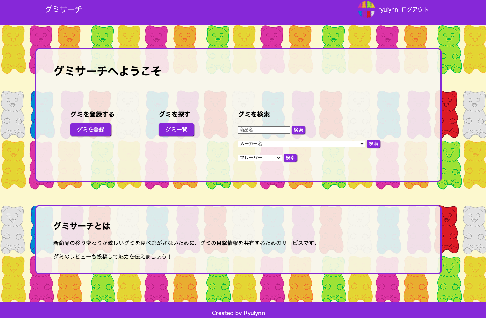
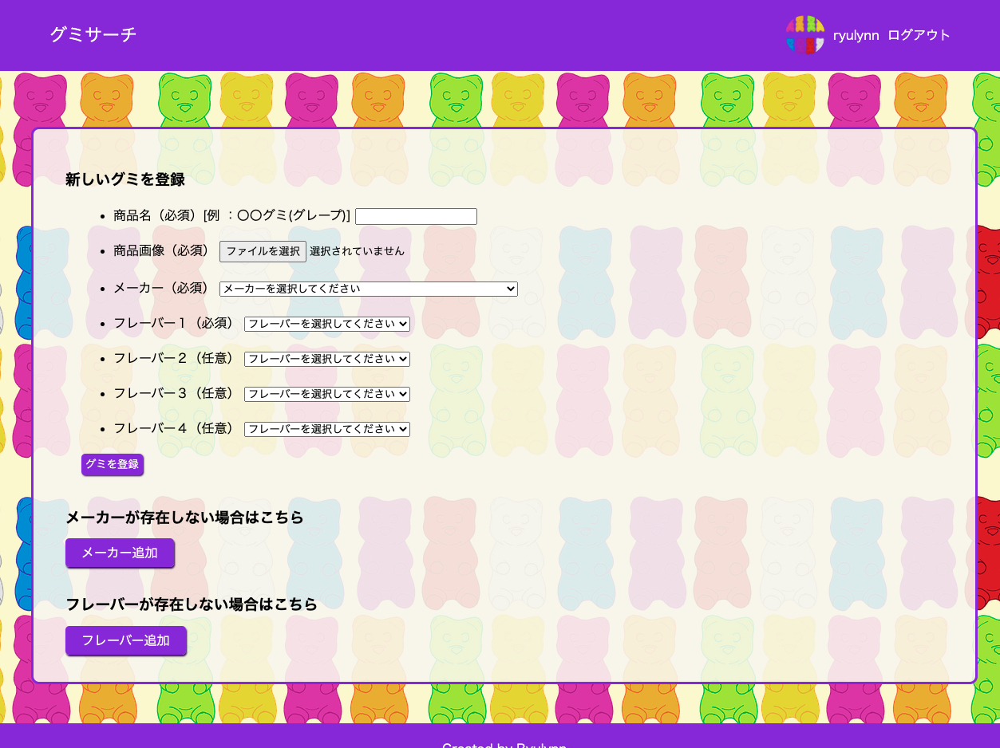
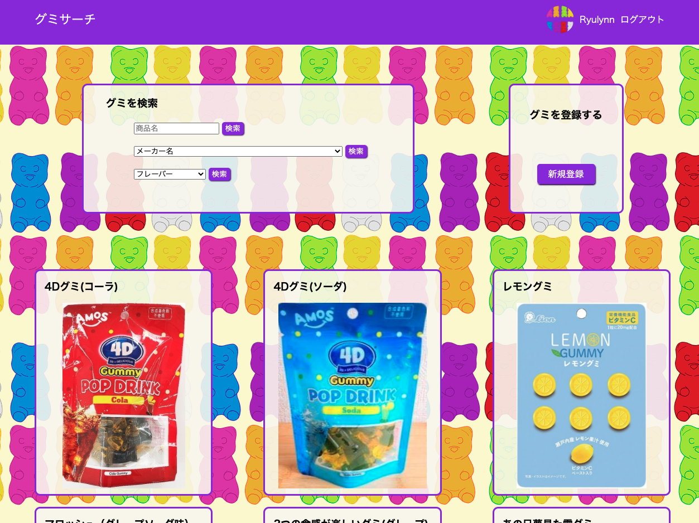
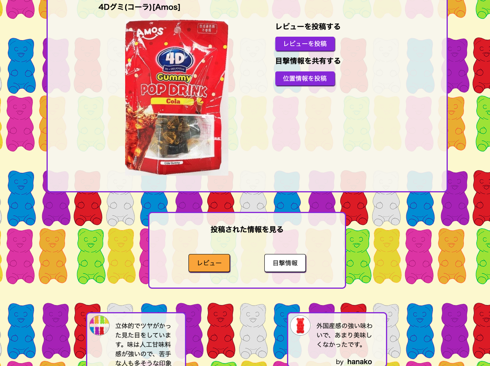
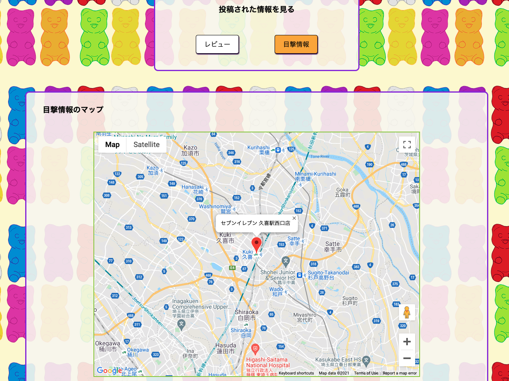

# グミサーチ

新商品の移り変わりが激しいグミを食べ逃がさないために、グミの目撃情報を共有するためのサービスです。
レビューも投稿できるようになっており、お気に入りのグミの魅力をアピールできます。

### 作成した目的

TwitterなどのSNSで紹介されているグミが近くの店舗で見当たらず、ネット販売もされておらず、食べたくても食べられない事がありました。
本アプリはそういった悩みを解決するために、グミの登録、位置情報の共有ができる仕様を意識して作成しました。

### URL

https://gummy-search.herokuapp.com

### 使い方

#### トップ画面

トップ画面では「グミの登録」「グミ一覧」「グミの検索」が使用できます。

* グミの登録：グミの新規登録画面へ遷移
* グミ一覧：登録されたグミを一覧表示する画面へ遷移
* グミの検索：登録されたグミの中から「フリーワード」「メーカー」「フレーバー」検索で絞り込み

#### グミの登録画面

グミ登録画面では商品名、商品画像、メーカー、フレーバー１を必須入力として登録できます。
メーカーとフレーバーは事前に登録された選択肢をプルダウンから選択する方式です。
もし選択肢がない場合は、下の２つのボタンから追加することができます。

#### グミ一覧画面

グミ一覧画面では、登録されたグミが一覧表示されており、任意のグミをクリックすることで、そのグミの詳細ページへ遷移します。
また、この画面でもグミの検索と、新規登録ページへの遷移が可能です。

#### グミ詳細画面

グミ詳細画面では、レビューと目撃情報の投稿ができます。
また、画面下側にはこのグミに投稿されたレビューが一覧表示されます。
「目撃情報」ボタンを押すことで、目撃情報のページに遷移します。

#### グミマップ画面

グミマップ画面では、登録された位置情報がGoogle Mapsにピンで表示され、ピンをクリックすることで店名を表示することができます。
また、「レビュー」ボタンを押すことで、レビューのページに遷移します。

### 使用技術

* HTML/CSS
* Javascript
* Ruby 2.7.3
* Rails 6.1.4
* RSpec/Rubocop
* MySQL
* Docker/Docker-compose
* CircleCI(ci/cd)
* Heroku
* AWS S3
* Google Maps API

### 機能一覧

* ユーザー登録・編集/ログイン機能
* adminユーザー機能
* グミ登録機能
* グミ検索機能(フリーワード、メーカー、フレーバー)
* レビュー機能
* 目撃情報(位置情報)投稿機能
* メーカー登録機能
* フレーバー登録機能
